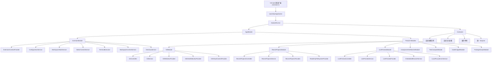

# ARCHITECTURE

# QuickOps 项目架构图与实现逻辑

## 1. 项目定位

QuickOps 是一个 VSCode 扩展项目，整体采用类似 NestJS 的模块化架构进行重构。

项目不直接引入 NestJS，而是自己实现了一套轻量模块系统，核心思想是：

* `module`：模块声明，负责组织 controller / service / provider
* `controller`：入口层，负责注册 VSCode 命令、事件、Provider
* `service`：业务逻辑层，负责功能实现
* `provider`：VSCode 能力适配层，例如 WebviewProvider、CompletionProvider、FileSystemProvider
* `common`：公共服务层，提供全局共享能力
* `core`：框架底座，提供容器、模块运行器、生命周期接口

---

## 2. 总体目录结构

```txt
src
├─ extension.ts
│
├─ app
│  ├─ app.module.ts
│  └─ quick-ops.application.ts
│
├─ core
│  ├─ container
│  │  ├─ container.ts
│  │  ├─ container.type.ts
│  │  └─ token.ts
│  │
│  ├─ module
│  │  ├─ module-runner.ts
│  │  └─ quick-ops-module.interface.ts
│  │
│  └─ lifecycle
│     └─ lifecycle.interface.ts
│
├─ common
│  ├─ common.module.ts
│  │
│  ├─ services
│  │  ├─ configuration.service.ts
│  │  ├─ workspace-state.service.ts
│  │  ├─ editor-context.service.ts
│  │  └─ terminal-executor.service.ts
│  │
│  ├─ providers
│  │  └─ extension-context.provider.ts
│  │
│  ├─ types
│  │  └─ common.type.ts
│  │
│  └─ utils
│     └─ common.util.ts
│
├─ modules
│  ├─ config-management
│  │  ├─ config-management.module.ts
│  │  ├─ config-management.controller.ts
│  │  └─ config-management.type.ts
│  │
│  ├─ file-navigation
│  │  ├─ file-navigation.module.ts
│  │  ├─ file-navigation.controller.ts
│  │  ├─ file-navigation.service.ts
│  │  └─ file-navigation.type.ts
│  │
│  ├─ smart-scroll
│  │  ├─ smart-scroll.module.ts
│  │  ├─ smart-scroll.controller.ts
│  │  └─ smart-scroll.service.ts
│  │
│  ├─ clipboard-transform
│  │  ├─ clipboard-transform.module.ts
│  │  ├─ clipboard-transform.controller.ts
│  │  └─ clipboard-transform.service.ts
│  │
│  ├─ log-enhancer
│  │  ├─ log-enhancer.module.ts
│  │  ├─ log-enhancer.controller.ts
│  │  └─ log-enhancer.service.ts
│  │
│  ├─ editor-history
│  │  ├─ editor-history.module.ts
│  │  ├─ editor-history.controller.ts
│  │  ├─ editor-history.service.ts
│  │  └─ editor-history.type.ts
│  │
│  ├─ mark-decoration
│  │  ├─ mark-decoration.module.ts
│  │  ├─ mark-decoration.controller.ts
│  │  └─ mark-decoration.service.ts
│  │
│  ├─ debug-console
│  │  ├─ debug-console.module.ts
│  │  ├─ debug-console.controller.ts
│  │  └─ debug-console.service.ts
│  │
│  ├─ anchor
│  │  ├─ anchor.module.ts
│  │  ├─ anchor.controller.ts
│  │  ├─ anchor.service.ts
│  │  └─ anchor.type.ts
│  │
│  ├─ mock-server
│  │  ├─ mock-server.module.ts
│  │  ├─ mock-server.controller.ts
│  │  ├─ mock-server.service.ts
│  │  └─ mock-server.type.ts
│  │
│  ├─ package-scripts
│  │  ├─ package-scripts.module.ts
│  │  ├─ package-scripts.controller.ts
│  │  ├─ package-scripts.service.ts
│  │  └─ package-scripts.type.ts
│  │
│  ├─ style-generator
│  │  ├─ style-generator.module.ts
│  │  ├─ style-generator.controller.ts
│  │  └─ style-generator.service.ts
│  │
│  ├─ project-export
│  │  ├─ project-export.module.ts
│  │  ├─ project-export.controller.ts
│  │  └─ project-export.service.ts
│  │
│  ├─ code-snippet
│  │  ├─ code-snippet.module.ts
│  │  ├─ code-snippet.controller.ts
│  │  ├─ code-snippet.service.ts
│  │  └─ code-snippet.type.ts
│  │
│  ├─ snippet-generator
│  │  ├─ snippet-generator.module.ts
│  │  ├─ snippet-generator.controller.ts
│  │  └─ snippet-generator.service.ts
│  │
│  ├─ live-preview
│  │  ├─ live-preview.module.ts
│  │  ├─ live-preview.controller.ts
│  │  ├─ live-preview.service.ts
│  │  ├─ providers
│  │  │  └─ live-preview.provider.ts
│  │  └─ webviews
│  │     └─ live-preview-app
│  │
│  ├─ recent-projects
│  │  ├─ recent-projects.module.ts
│  │  ├─ recent-projects.controller.ts
│  │  ├─ recent-projects.service.ts
│  │  ├─ recent-projects.type.ts
│  │  ├─ providers
│  │  │  ├─ recent-projects.provider.ts
│  │  │  └─ read-only-file-system.provider.ts
│  │  └─ webviews
│  │     └─ recent-projects-app
│  │
│  ├─ component-intellisense
│  │  ├─ component-intellisense.module.ts
│  │  ├─ component-intellisense.controller.ts
│  │  ├─ component-intellisense.service.ts
│  │  ├─ component-intellisense.type.ts
│  │  └─ providers
│  │     └─ component-completion.provider.ts
│  │
│  ├─ text-compare
│  │  ├─ text-compare.module.ts
│  │  ├─ text-compare.controller.ts
│  │  └─ text-compare.service.ts
│  │
│  ├─ git
│  │  ├─ git.module.ts
│  │  ├─ git.controller.ts
│  │  ├─ git.service.ts
│  │  ├─ git.type.ts
│  │  ├─ git.constant.ts
│  │  ├─ providers
│  │  │  ├─ git-webview.provider.ts
│  │  │  ├─ git-detail-webview.provider.ts
│  │  │  └─ git-virtual-content.provider.ts
│  │  └─ webviews
│  │     ├─ git-app
│  │     └─ git-detail-app
│  │
│  ├─ inline-constant-hint
│  │  ├─ inline-constant-hint.module.ts
│  │  ├─ inline-constant-hint.controller.ts
│  │  ├─ inline-constant-hint.service.ts
│  │  └─ providers
│  │     └─ inline-constant-hint.provider.ts
│  │
│  └─ focus-history
│     ├─ focus-history.module.ts
│     ├─ focus-history.controller.ts
│     └─ focus-history.service.ts
│
└─ utils
   ├─ AstParser.ts
   ├─ ColorLog.ts
   ├─ ColorUtils.ts
   ├─ LogHelper.ts
   ├─ recentProjectPath.ts
   ├─ recentProjectSearch.ts
   ├─ StyleStructureParser.ts
   ├─ TemplateEngine.ts
   └─ WebviewHelper.ts
```

---

## 3. 项目架构图



---

## 4. 启动流程

整体启动入口是 `src/extension.ts`。

```ts
export async function activate(context: vscode.ExtensionContext) {
  app = new QuickOpsApplication(context);
  await app.start();
}
```

启动流程如下：

```txt
VSCode 启动扩展
  ↓
执行 extension.ts 的 activate(context)
  ↓
创建 QuickOpsApplication
  ↓
QuickOpsApplication 创建 Container
  ↓
ModuleRunner 读取 AppModule
  ↓
递归注册 imports / providers / controllers
  ↓
Container 根据 static inject 自动创建实例
  ↓
ModuleRunner 调用 controller.onModuleInit()
  ↓
各模块注册 VSCode 命令、事件、Webview、Provider
  ↓
扩展功能可用
```

---

## 5. 核心模块职责

### 5.1 extension.ts

扩展入口文件。

负责接收 VSCode 提供的 `ExtensionContext`，并启动整个应用。

主要职责：

* 创建 `QuickOpsApplication`
* 调用 `app.start()`
* 在扩展卸载时调用 `app.dispose()`

---

### 5.2 app.module.ts

项目根模块。

负责声明整个项目要启用哪些模块。

示例：

```ts
export const AppModule: QuickOpsModule = {
  imports: [
    CommonModule,
    GitModule,
    RecentProjectsModule,
    LivePreviewModule,
    ComponentIntellisenseModule,
    TextCompareModule,
  ],
};
```

它相当于整个扩展的模块入口。

---

### 5.3 quick-ops.application.ts

应用启动器。

主要职责：

* 持有 VSCode `ExtensionContext`
* 创建依赖注入容器 `Container`
* 注册 `ExtensionContext`
* 启动 `ModuleRunner`
* 统一释放资源

---

### 5.4 core/container

`core/container` 是整个架构的依赖注入核心。

主要文件：

```txt
core/container
├─ container.ts
├─ container.type.ts
└─ token.ts
```

主要职责：

* 注册 provider
* 根据 token 查找 provider
* 创建 class 实例
* 根据 `static inject` 自动注入构造函数依赖
* 缓存实例，默认单例
* 统一调用 `dispose()`
* 检查 undefined 依赖
* 检查循环依赖

---

### 5.5 core/module

`core/module` 负责模块运行。

主要文件：

```txt
core/module
├─ module-runner.ts
└─ quick-ops-module.interface.ts
```

`QuickOpsModule` 用来描述一个模块：

```ts
export interface QuickOpsModule {
  imports?: QuickOpsModule[];
  controllers?: InjectableConstructor[];
  providers?: Provider[];
  exports?: InjectionToken[];
  global?: boolean;
}
```

`ModuleRunner` 负责读取模块配置，并把模块中的 providers / controllers 注册到容器。

---

### 5.6 core/lifecycle

生命周期接口。

```ts
export interface OnModuleInit {
  onModuleInit(context: vscode.ExtensionContext): void | Promise<void>;
}

export interface OnModuleDestroy {
  onModuleDestroy(): void | Promise<void>;
}
```

controller 通常会实现 `OnModuleInit`，在初始化阶段注册命令、事件、Provider。

---

## 6. CommonModule 公共模块

`CommonModule` 是全局公共模块，给所有业务模块提供基础能力。

目录：

```txt
common
├─ common.module.ts
├─ services
│  ├─ configuration.service.ts
│  ├─ workspace-state.service.ts
│  ├─ editor-context.service.ts
│  ├─ terminal-executor.service.ts
│  ├─ workspace-context.service.ts
│  └─ directory.service.ts
└─ providers
   └─ extension-context.provider.ts
```

### 6.1 ExtensionContextProvider

封装 VSCode 的 `ExtensionContext`。

作用：

* 获取 `context.subscriptions`
* 获取 `extensionUri`
* 获取 `globalState`
* 获取 `workspaceState`
* 统一注册 disposable

示例：

```ts
this.extensionContextProvider.register(
  vscode.commands.registerCommand('quickOps.xxx', () => {})
);
```

---

### 6.2 ConfigurationService

配置服务。

主要负责：

* 读取扩展配置
* 监听配置变化
* 提供配置事件通知

---

### 6.3 WorkspaceStateService

封装 `workspaceState`。

主要负责：

* 保存工作区级别状态
* 读取工作区缓存
* 管理模块内部持久化数据

---

### 6.4 EditorContextService

编辑器上下文服务。

主要负责：

* 获取当前激活编辑器
* 获取当前文件路径
* 获取选中文本
* 判断当前文件类型

---

### 6.5 TerminalExecutor

终端执行服务。

主要负责：

* 创建 VSCode Terminal
* 执行 shell 命令
* 管理命令执行终端

---

### 6.6 WorkspaceContextService

工作区上下文服务。

主要负责生成模板变量，例如：

```txt
fileName
filePath
projectName
projectVersion
dependencies
isVue3
isReact
isTypeScript
gitBranch
userName
dateTime
```

这些变量会被代码片段、脚本执行、模板生成等功能使用。

---

### 6.7 DirectoryService

目录工具服务。

主要负责：

* 读取目录
* 创建文件
* 创建文件夹
* 删除文件
* 重命名文件
* 搜索文件名
* 搜索文件内容
* 获取 Git 状态
* 获取 diagnostics 信息

它主要服务于 `recent-projects` 等资源管理类模块。

---

## 7. 业务模块设计规范

每个业务模块一般采用下面结构：

```txt
modules/example
├─ example.module.ts
├─ example.controller.ts
├─ example.service.ts
├─ example.type.ts
└─ providers
   └─ example.provider.ts
```

### 7.1 module

模块声明文件。

负责声明当前模块的 providers / controllers / exports。

```ts
export const ExampleModule: QuickOpsModule = {
  imports: [CommonModule],
  controllers: [ExampleController],
  providers: [ExampleService, ExampleProvider],
  exports: [ExampleService],
};
```

---

### 7.2 controller

模块入口层。

主要负责：

* 注册 VSCode 命令
* 注册事件监听
* 注册 Provider
* 调用 service 完成业务动作

```ts
export class ExampleController implements OnModuleInit {
  public static inject = [
    ExtensionContextProvider,
    ExampleService,
    ExampleProvider,
  ];

  public onModuleInit(): void {
    this.registerCommands();
    this.registerListeners();
    this.registerProviders();
  }
}
```

---

### 7.3 service

业务逻辑层。

主要负责：

* 数据处理
* 文件操作
* 状态管理
* 调用 Git / FS / VSCode API
* 提供给 controller / provider 调用的方法

---

### 7.4 provider

VSCode 能力适配层。

常见 provider 类型：

```txt
WebviewViewProvider
TextDocumentContentProvider
CompletionItemProvider
HoverProvider
FileSystemProvider
CodeLensProvider
InlayHintsProvider
```

provider 不应该写太多复杂业务逻辑，复杂逻辑应该放到 service 中。

---

### 7.5 type

模块类型声明。

主要放：

* 接口
* 类型别名
* Webview message 类型
* 数据结构类型

---

## 8. GitModule 实现逻辑

目录：

```txt
modules/git
├─ git.module.ts
├─ git.controller.ts
├─ git.service.ts
├─ git.type.ts
├─ git.constant.ts
└─ providers
   ├─ git-webview.provider.ts
   ├─ git-detail-webview.provider.ts
   └─ git-virtual-content.provider.ts
```

### 8.1 职责

GitModule 负责 Git 相关能力：

* 查看工作区 Git 状态
* 查看暂存区 / 工作区文件
* stage / unstage
* commit
* push / pull / fetch
* 切换分支
* 查看提交历史
* 打开 Git 详情 Webview
* 对比旧代码
* 克隆仓库
* 修改远程仓库地址

---

### 8.2 实现流程

```txt
GitController.onModuleInit()
  ↓
注册 Git WebviewViewProvider
  ↓
注册 GitVirtualContentProvider
  ↓
注册 Git 命令
  ↓
监听文件保存 / 创建 / 删除 / 重命名
  ↓
触发 GitWebviewProvider.refresh()
```

---

### 8.3 GitService

`GitService` 是 Git 业务核心。

主要负责：

* 封装 `simple-git`
* 获取 Git 状态
* 获取分支
* 获取提交日志
* stage / unstage / discard
* commit / push / pull / fetch
* 克隆仓库
* 获取文件历史
* 获取指定 ref 的文件内容

---

### 8.4 GitVirtualContentProvider

用于 Git diff 的虚拟文档内容。

例如对比当前文件和 `HEAD`：

```txt
quickops-git:/src/a.ts?query=...
```

Provider 根据 URI 中的参数读取：

```txt
HEAD:file
index:file
working:file
commitHash:file
```

再返回对应内容给 VSCode Diff Editor。

为了避免循环依赖，推荐：

```txt
GitService 使用 git-uri.util.ts 创建虚拟 URI
GitVirtualContentProvider 使用 import type GitService
GitController 通过 setGitService 手动注入 GitService 实例
```

---

## 9. RecentProjectsModule 实现逻辑

目录：

```txt
modules/recent-projects
├─ recent-projects.module.ts
├─ recent-projects.controller.ts
├─ recent-projects.service.ts
├─ recent-projects.type.ts
└─ providers
   ├─ recent-projects.provider.ts
   └─ read-only-file-system.provider.ts
```

### 9.1 职责

RecentProjectsModule 负责项目资源管理视图。

主要能力：

* 展示最近项目
* 添加本地项目
* 添加远程项目
* 打开项目
* 读取目录树
* 文件搜索
* 文本搜索
* 文件新建 / 删除 / 重命名
* 只读远程文件系统
* 展示 Git 状态
* 展示 diagnostics 信息

---

### 9.2 Webview 初始化流程

```txt
VSCode 显示 RecentProjects Webview
  ↓
RecentProjectsProvider.resolveWebviewView()
  ↓
加载 React Webview 页面
  ↓
React 页面发送 ready / webviewLoaded
  ↓
Provider 收到消息
  ↓
Provider 调用 refresh()
  ↓
读取最近项目列表
  ↓
postMessage 给 React
  ↓
React 关闭 loading，展示项目树
```

如果页面一直停留在 loading，一般是：

```txt
1. React 没发送 ready
2. Provider 没处理 ready
3. refresh 没 postMessage
4. 前后端 message.type 不一致
```

---

### 9.3 ReadOnlyFileSystemProvider

只读文件系统 Provider。

主要用于远程项目或虚拟项目预览。

特点：

* 支持 `stat`
* 支持 `readDirectory`
* 支持 `readFile`
* 不支持写入
* create / delete / rename 会抛出 NoPermissions

---

## 10. LivePreviewModule 实现逻辑

目录：

```txt
modules/live-preview
├─ live-preview.module.ts
├─ live-preview.controller.ts
├─ live-preview.service.ts
├─ providers
│  └─ live-preview.provider.ts
└─ services
   ├─ embedded-browser.service.ts
   └─ local-proxy-server.service.ts
```

### 10.1 职责

LivePreviewModule 负责内嵌浏览器和本地文件预览。

主要能力：

* 打开网页预览
* 打开本地 HTML
* 预览 Markdown
* 预览 PDF
* 预览 Excel
* 收藏常用网址
* 使用本地代理绕过部分 iframe / CSP 限制
* 支持 Webview 和 VSCode 通信

---

### 10.2 实现流程

```txt
用户执行 openLivePreview 命令
  ↓
LivePreviewController 调用 LivePreviewProvider
  ↓
创建 WebviewPanel
  ↓
加载 React Webview 页面
  ↓
React 发送 ready
  ↓
Provider 发送初始化数据
  ↓
用户输入 URL 或打开本地文件
  ↓
Provider 调用 LivePreviewService / EmbeddedBrowserService
  ↓
返回预览结果给 Webview
```

---

### 10.3 LocalProxyServerService

本地代理服务。

主要作用：

* 启动本地 HTTP Server
* 转发目标网页请求
* 去掉 `x-frame-options`
* 去掉部分 `content-security-policy`
* 重写 HTML 中的资源路径
* 处理跳转
* 让网页可以在 VSCode Webview iframe 中展示

---

## 11. ComponentIntellisenseModule 实现逻辑

目录：

```txt
modules/component-intellisense
├─ component-intellisense.module.ts
├─ component-intellisense.controller.ts
├─ component-intellisense.service.ts
├─ component-intellisense.type.ts
└─ providers
   └─ component-completion.provider.ts
```

### 11.1 职责

组件智能提示模块。

主要能力：

* 根据项目依赖判断 UI 框架
* 加载 `resources/ui-snippets`
* 提供组件标签补全
* 提供组件属性补全
* 提供事件补全
* 提供插槽补全
* 提供 hover 文档
* 导出 VSCode snippet

---

### 11.2 实现流程

```txt
ComponentIntellisenseController.onModuleInit()
  ↓
ComponentIntellisenseService.init()
  ↓
读取 resources/ui-snippets
  ↓
根据 package.json dependencies 判断启用哪些组件库
  ↓
注册 CompletionItemProvider
  ↓
注册 HoverProvider
  ↓
用户在 Vue / React / HTML 中输入
  ↓
Provider 返回补全项或 Hover 文档
```

---

## 12. TextCompareModule 实现逻辑

目录：

```txt
modules/text-compare
├─ text-compare.module.ts
├─ text-compare.controller.ts
└─ text-compare.service.ts
```

### 12.1 职责

文本对比模块。

主要能力：

* 打开文本对比 Webview
* 支持用户输入原文和修改后文本
* 使用 VSCode 原生 Diff Editor 展示差异

---

### 12.2 实现流程

```txt
用户执行 quick-ops.openTextCompare
  ↓
TextCompareService 创建 WebviewPanel
  ↓
React Webview 输入两段文本
  ↓
Webview 发送 runDiff
  ↓
TextCompareService 创建 quickops-diff 虚拟文档
  ↓
执行 vscode.diff
  ↓
打开 VSCode 原生 Diff Editor
```

---

## 13. CodeSnippetModule 与 SnippetGeneratorModule

### 13.1 CodeSnippetModule

负责代码片段补全。

主要能力：

* 加载内置 snippets
* 加载用户自定义 snippets
* 根据语言和依赖环境过滤 snippets
* 使用 WorkspaceContextService 渲染模板变量
* 注册 CompletionItemProvider

---

### 13.2 SnippetGeneratorModule

负责从选中代码生成代码片段。

主要能力：

* 获取当前选中文本
* 输入 prefix
* 输入 description
* 保存到 workspaceState
* 通知 CodeSnippetModule 刷新 snippets

---

## 14. PackageScriptsModule 实现逻辑

目录：

```txt
modules/package-scripts
├─ package-scripts.module.ts
├─ package-scripts.controller.ts
├─ package-scripts.service.ts
└─ package-scripts.type.ts
```

### 14.1 职责

脚本执行模块。

主要能力：

* 读取当前项目 `package.json`
* 获取 scripts
* 读取内置 shell 模板
* 通过 QuickPick 选择脚本
* 使用 TerminalExecutor 执行命令
* 支持变量模板渲染

---

## 15. ProjectExportModule 实现逻辑

目录：

```txt
modules/project-export
├─ project-export.module.ts
├─ project-export.controller.ts
└─ project-export.service.ts
```

### 15.1 职责

导入导出辅助模块。

主要能力：

* import 路径补全
* export 成员补全
* 自动插入 import 语句
* 解析目标文件导出内容

---

## 16. StyleGeneratorModule 实现逻辑

目录：

```txt
modules/style-generator
├─ style-generator.module.ts
├─ style-generator.controller.ts
└─ style-generator.service.ts
```

### 16.1 职责

样式结构生成模块。

主要能力：

* 解析当前 Vue / HTML / JSX 文件结构
* 提取 class / id
* 生成 SCSS 结构
* 复制到剪贴板

---

## 17. AnchorModule 实现逻辑

目录：

```txt
modules/anchor
├─ anchor.module.ts
├─ anchor.controller.ts
├─ anchor.service.ts
└─ anchor.type.ts
```

### 17.1 职责

代码锚点模块。

主要能力：

* 添加锚点
* 根据分组展示锚点
* 快速跳转锚点
* 删除锚点
* CodeLens 展示锚点
* MindMap Webview 展示锚点关系

---

## 18. InlineConstantHintModule 实现逻辑

目录：

```txt
modules/inline-constant-hint
├─ inline-constant-hint.module.ts
├─ inline-constant-hint.controller.ts
├─ inline-constant-hint.service.ts
└─ providers
   └─ inline-constant-hint.provider.ts
```

### 18.1 职责

常量行内提示模块。

主要能力：

* 解析当前文档中的常量
* 解析 enum
* 解析对象常量
* 使用 InlayHintsProvider 显示常量值
* 支持刷新和开关命令

---

## 19. FocusHistoryModule 实现逻辑

目录：

```txt
modules/focus-history
├─ focus-history.module.ts
├─ focus-history.controller.ts
└─ focus-history.service.ts
```

### 19.1 职责

编辑器焦点历史模块。

主要能力：

* 监听光标位置变化
* 记录最近焦点位置
* 支持回到上一个焦点
* 支持清空焦点历史

---

## 20. Webview 通信逻辑

项目中的 Webview 功能一般都采用相同通信模式。

### 20.1 后端发送给前端

```ts
webview.postMessage({
  type: 'init',
  payload: data,
});
```

### 20.2 前端发送给后端

```ts
vscode.postMessage({
  type: 'ready',
});
```

### 20.3 常见消息类型

```txt
ready
webviewLoaded
init
refresh
update
error
readDir
openFile
runDiff
saveUrl
toggleFavorite
```

---

## 21. 新增一个模块的标准步骤

假设新增模块 `demo`。

### 21.1 创建目录

```txt
src/modules/demo
├─ demo.module.ts
├─ demo.controller.ts
├─ demo.service.ts
└─ demo.type.ts
```

### 21.2 编写 service

```ts
export class DemoService {
  public doSomething(): void {
    // business logic
  }
}
```

### 21.3 编写 controller

```ts
export class DemoController implements OnModuleInit {
  public static inject = [
    ExtensionContextProvider,
    DemoService,
  ];

  constructor(
    private readonly extensionContextProvider: ExtensionContextProvider,
    private readonly demoService: DemoService,
  ) {}

  public onModuleInit(): void {
    this.extensionContextProvider.register(
      vscode.commands.registerCommand('quickOps.demo', () => {
        this.demoService.doSomething();
      }),
    );
  }
}
```

### 21.4 编写 module

```ts
export const DemoModule: QuickOpsModule = {
  imports: [CommonModule],
  controllers: [DemoController],
  providers: [DemoService],
  exports: [DemoService],
};
```

### 21.5 加入 AppModule

```ts
export const AppModule: QuickOpsModule = {
  imports: [
    CommonModule,
    DemoModule,
  ],
};
```

### 21.6 package.json 注册命令

```json
{
  "contributes": {
    "commands": [
      {
        "command": "quickOps.demo",
        "title": "QuickOps: Demo"
      }
    ]
  }
}
```

---

## 22. 架构约定

### 22.1 controller 只负责入口

controller 不写复杂业务，只负责：

```txt
注册命令
注册监听
注册 Provider
调用 service
```

---

### 22.2 service 负责业务逻辑

service 负责：

```txt
数据处理
状态管理
文件操作
Git 操作
模板渲染
业务流程
```

---

### 22.3 provider 负责 VSCode API 适配

provider 负责：

```txt
Webview
Completion
Hover
CodeLens
InlayHint
FileSystemProvider
TextDocumentContentProvider
```

---

### 22.4 type 文件只放类型

`*.type.ts` 只放：

```txt
interface
type
enum
message payload
```

---

### 22.5 constant 文件只放常量

`*.constant.ts` 只放：

```txt
命令名
View ID
Storage Key
Webview Route
```

---

## 23. 常见问题定位

### 23.1 启动失败：inject 是 undefined

原因：

```txt
import 写错
没有 export
循环引用
provider 没注册
```

处理：

```txt
1. 看报错中的类名
2. 找到该类 static inject
3. 检查第 N 个依赖
4. 确认 import/export
5. 检查是否循环引用
```

---

### 23.2 Webview 一直 loading

原因：

```txt
前端没有发送 ready
后端没有处理 ready
后端没有 postMessage 初始化数据
前后端 message.type 不一致
Webview route 不一致
UI 没重新 build
```

处理：

```txt
1. resolveWebviewView 中加日志
2. onDidReceiveMessage 中加日志
3. refresh 中加日志
4. 检查前端监听的 message.type
5. 检查 getReactWebviewHtml 的 route
```

---

### 23.3 断点无法命中

原因：

```txt
launch.json outFiles 指向错误
webpack sourceMap 配置错误
运行的是 dist/extension.js，但断点打在 ts 没映射
webpack 开启了压缩或 concatenateModules
```

处理：

```txt
1. outFiles 指向 dist/**/*.js
2. devtool 使用 source-map
3. 调试时关闭 minimize
4. 调试时关闭 concatenateModules
5. 清除 dist 和 webpack cache
```

---

## 24. 总结

QuickOps 重构后的整体架构是：

```txt
extension.ts
  ↓
QuickOpsApplication
  ↓
ModuleRunner
  ↓
AppModule
  ↓
CommonModule + Feature Modules
  ↓
Container 自动注入依赖
  ↓
Controller 注册 VSCode 能力
  ↓
Service 执行业务逻辑
  ↓
Provider 对接 Webview / Completion / FS / Diff 等 VSCode API
```

这种架构的优点是：

```txt
模块边界清晰
职责分层明确
功能可独立维护
方便新增模块
方便排查依赖问题
方便统一释放资源
减少到处手动 new 的代码
```
