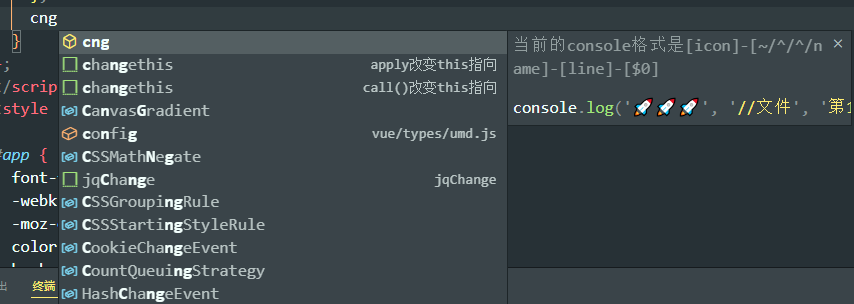
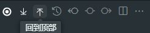
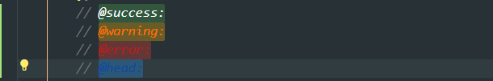
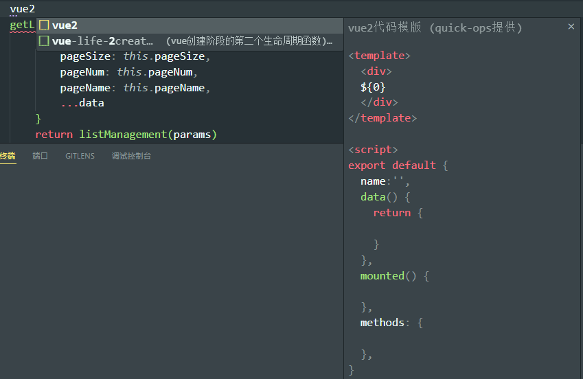

   

# quickOps

`quickOps` 是一款面向开发者的 **VSCode 开发辅助插件**，提供了一系列高效实用的功能，帮助你快速完成常见操作，显著提升开发效率：

- 🚀 **自定义 Console 调试**：一键插入个性化调试语句。
- 📂 **文件快速定位与展开**：快速跳转到目标文件或目录。
- ⬆️⬇️ **快捷滚动**：一键滚动到文件顶部或底部。
- 📦 **导入语句自动化**：智能生成并维护 import/export。
- 🏷 **自定义标注提醒（Mark）**：高亮和追踪重要代码片段。
- ✨ **条件化代码片段**：支持逻辑判断的个性化代码片段。
- 🚫 **文件隔离**：通过自定义忽略规则，解耦工作区与远程仓库。

让你在 VSCode 中操作更快捷，专注于核心开发。

##  🚀 **自定义 Console 调试**

通过输入关键字段即可插入预设的 `console` 模板，在浏览器调试页面中快速定位打印位置。相比于手动反复输出 `111` 或 `222` 等标记，这种方式更高效、更直观，能够大幅提升调试效率。📂 **文件快速定位与展开**

## ⬆️⬇️ **快捷滚动**

当项目文件代码量很大时，手动滚动到顶部或底部非常耗时。`quickOps` 提供一键回到顶部和一键回到底部的功能，让你在 Vue 项目中快速查看 `template` 结构，或者迅速定位到 `style` 区块写样式，大幅提升代码浏览与编辑效率。

## 📦 **导入语句自动化**

从你输入 `'./'` 的那一刻起，`quickOps` 即可智能提示项目中的文件和文件夹。当你选中文件（例如 `.js` 文件）并回车时，插件会自动解析文件内的函数，并允许你自由选择要导入的函数，极大提升导入语句的效率与准确性。

## 🏷 **自定义标注提醒（Mark）**

新增mark，可以新增更多的标注提示，后期新增对颜色自定义一句智能化提示

## ✨ **条件化代码片段**

新增代码片段，可以设定在什么环境生效，以及什么框架生效（vue2、vue3、react）

## 🚫 **文件隔离**

文件隔离的作用主要是新拉取下来的代码个人会有不同的改动，又不想推送到远程，但是被远程分支跟踪，在.gitignore添加会导致不小心上传.gitignore导致不好的效果，quickOps配置文件（配置文件初始化也是不被版本跟踪）新增git字段可以忽略文件跟踪（不被版本跟踪）

---

## 🛠️ 使用方法

1. 安装插件后，插件会自动在 VSCode 激活。  
2. 通过命令面板（`Ctrl+Shift+P` / `Cmd+Shift+P`）输入 **quickOps: XXX** 使用对应功能。  
3. 部分功能支持快捷键触发，可在 `keybindings.json` 中自行配置。  

---
