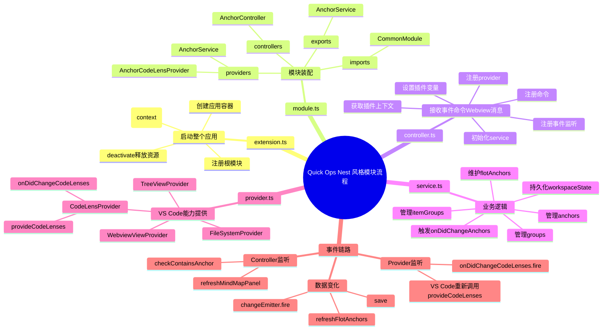
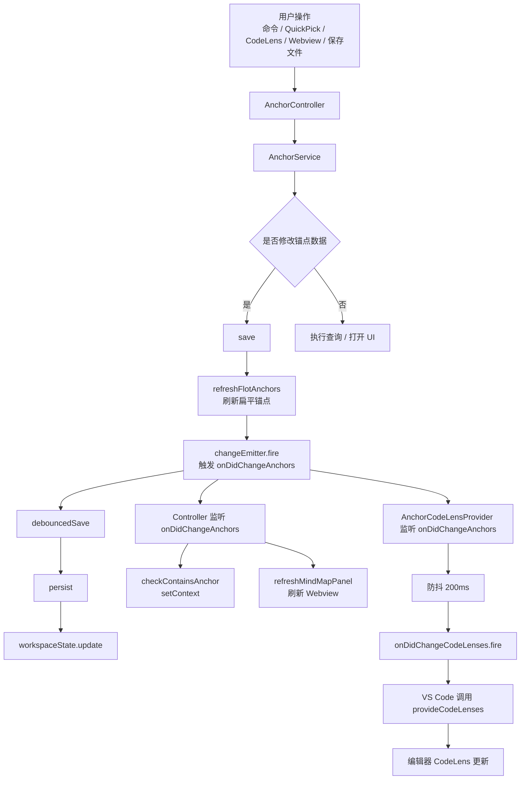
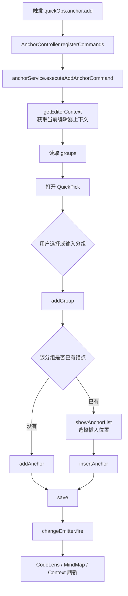

# Quick Ops 模块 Nest 风格重构流程说明

> 以 `AnchorModule` 为例，梳理 `extension.ts / module.ts / controller.ts / service.ts / provider.ts` 的职责边界、启动流程、事件监听和数据刷新链路。

本文可以按四个核心画面来读：

- 先看模块职责：每个文件只负责自己的那一层。
- 再看启动加载：controller 把入口接住，service 恢复工作区锚点。
- 再看数据变化：统一走 `save()`，由事件扩散刷新 UI。
- 最后看 CodeLens：provider 负责通知 VS Code 重新计算展示。

---

## 1. 文件职责划分


这张图里的五个抽屉对应当前模块的五层职责。线团代表混在一起的入口、业务、状态和 UI 逻辑，重构的目标就是把这些线拆回正确的位置。

### `extension.ts`

负责启动整个应用。

主要职责：

- 接收 VS Code 插件入口 `activate(context)`
- 创建或启动应用容器
- 注册根模块
- 把 `ExtensionContext` 注入到公共上下文服务
- 在 `deactivate()` 时释放容器资源

```txt
extension.ts = 应用启动入口
```

### `module.ts`

负责把当前功能模块需要的 controller、service、provider 注册起来。

```ts
export const AnchorModule: QuickOpsModule = {
  imports: [CommonModule],
  controllers: [AnchorController],
  providers: [AnchorService],
  exports: [AnchorService],
};
```

主要职责：

- 声明依赖哪些模块
- 声明当前模块有哪些 controller
- 声明当前模块有哪些 service / provider
- 声明哪些能力可以导出给其它模块使用

```txt
module.ts = 模块装配清单
```

### `controller.ts`

负责接收 VS Code 事件、命令、Webview message，并把请求转发给 service。

主要职责：

- 获取插件上下文
- 初始化 service 层
- 注册 provider
- 注册事件监听
- 注册命令
- 设置 VS Code context 变量

```txt
controller.ts = VS Code 入口层 / 事件命令适配层
```

注意：controller 不应该写复杂业务逻辑，复杂业务应该下沉到 service。

### `service.ts`

负责业务逻辑、状态管理、数据持久化和业务事件派发。

主要职责：

- 管理锚点数据
- 管理分组数据
- 新增 / 删除 / 修改 / 移动锚点
- 维护树形锚点和扁平锚点
- 持久化到 `workspaceState`
- 派发 `onDidChangeAnchors` 事件
- 提供 provider 需要的数据查询能力

```txt
service.ts = 业务核心层
```

### `provider.ts`

负责 VS Code UI 或能力提供。

常见 provider 类型：

- `CodeLensProvider`
- `TreeDataProvider`
- `WebviewViewProvider`
- `FileSystemProvider`
- `HoverProvider`
- `CompletionItemProvider`

以当前 Anchor 模块为例，`AnchorCodeLensProvider` 负责：

- 根据当前文档生成 CodeLens
- 监听 service 的锚点变化事件
- 触发 VS Code 重新调用 `provideCodeLenses`
- 把锚点显示成编辑器上的行内操作入口

```txt
provider.ts = VS Code UI / 能力提供层
```

---

## 2. 整体思维导图



---

## 3. 从 `controller.ts` 开始的启动流程


启动链路可以理解成小黑推着 `ExtensionContext` 依次经过 controller、service，最后从 `workspaceState` 里把历史锚点恢复出来。

### 3.1 获取插件上下文

controller 初始化时，先通过公共 provider 获取 VS Code 插件上下文：

```ts
const context = this.extensionContextProvider.getContext();
```

这个 `context` 是后续注册命令、事件、provider、workspaceState 的基础。

### 3.2 初始化 service 层

controller 调用：

```ts
this.anchorService.init(context);
```

进入 service 后，主要做两件事：

```txt
1. 赋值插件上下文
2. 加载工作区锚点数据
```

流程：

```txt
AnchorController.onModuleInit()
  -> anchorService.init(context)
      -> this.context = context
      -> this.load()
```

### 3.3 service 加载工作区锚点

`load()` 的职责是从 `workspaceState` 里恢复当前工作区的锚点数据。

流程：

```txt
load()
  -> context.workspaceState.get('quickOps.workspaceAnchors')
  -> 获取 anchors
  -> 获取 groups
  -> 获取 children / itemGroups
  -> refreshFlotAnchors()
  -> changeEmitter.fire()
```

数据结构：

```txt
anchors
  树形锚点数据，是真正持久化的数据

groups
  一级锚点分组

itemGroups
  子分组名称记录

flotAnchors
  扁平化锚点数据，方便查询
```

注意：

```txt
load() 里触发的 changeEmitter.fire()
在当前 controller 初始化顺序下，可能还没有监听者注册完成。
所以它不是最重要的刷新来源。

真正核心的是 save() 里的 changeEmitter.fire()。
```

### 3.4 注册当前模块设计的 provider

controller 调用：

```ts
this.registerCodeLensProvider();
```

内部流程：

```txt
registerCodeLensProvider()
  -> anchorService.createCodeLensProvider()
  -> new AnchorCodeLensProvider(anchorService, extensionContextProvider)
  -> vscode.languages.registerCodeLensProvider({ scheme: 'file' }, provider)
```

这里分两步理解。

第一步：创建 provider。

```txt
AnchorService.createCodeLensProvider()
  -> new AnchorCodeLensProvider(...)
```

第二步：注册给 VS Code。

```txt
vscode.languages.registerCodeLensProvider(...)
```

注册后，VS Code 会在需要展示 CodeLens 时调用：

```ts
provideCodeLenses(document);
```

注意：

```txt
provideCodeLenses 不是你手动调用的。
它是 VS Code 在打开文件、切换文件、刷新 CodeLens 时自动调用的。
```

### 3.5 provider 初始化与监听 service 事件

`AnchorCodeLensProvider` 内部会监听 service 的事件：

```txt
AnchorCodeLensProvider.constructor()
  -> anchorService.onDidChangeAnchors(...)
```

当 service 数据变化时：

```txt
AnchorService.changeEmitter.fire()
  -> AnchorCodeLensProvider 收到 onDidChangeAnchors
  -> 防抖 200ms
  -> CodeLensProvider.changeEmitter.fire()
  -> VS Code 收到 onDidChangeCodeLenses
  -> VS Code 重新调用 provideCodeLenses(document)
```

这里有两个事件，不要混淆：

```txt
AnchorService.onDidChangeAnchors
  业务事件，表示锚点数据变了

AnchorCodeLensProvider.onDidChangeCodeLenses
  VS Code 约定事件，表示 CodeLens 需要重新计算
```

### 3.6 注册当前模块涉及的事件

controller 负责注册 VS Code 事件和业务事件监听。

建议保留的事件：

```ts
this.anchorService.onDidChangeAnchors(() => {
  this.anchorService.checkContainsAnchor();
  this.anchorService.refreshMindMapPanel();
});
```

作用：

```txt
锚点数据变化
  -> 更新 VS Code context 变量
  -> 刷新 MindMap 面板
```

文档保存事件：

```ts
vscode.workspace.onDidSaveTextDocument((doc) => {
  void this.anchorService.syncAnchorsWithContent(doc);
});
```

作用：

```txt
文件保存
  -> 检查锚点行号是否偏移
  -> 尝试根据内容重新定位
  -> 必要时更新锚点行号或内容
```

删除 decoration 之后，建议删除这些监听：

```ts
vscode.window.onDidChangeActiveTextEditor(() => {
  this.anchorService.updateDecorationsDebounced();
});
```

因为现在锚点展示主要依赖 CodeLens，不再依赖 decoration。

### 3.7 注册当前模块命令

controller 负责注册命令，但命令内部不写复杂业务，只转发给 service。

命令示例：

```txt
quickOps.anchor.add
  -> anchorService.executeAddAnchorCommand(...args)

quickOps.anchor.showMenu
  -> anchorService.executeShowAnchorMenuCommand()

quickOps.anchor.listByGroup
  -> anchorService.showAnchorList(groupName, true, undefined, anchorId)

quickOps.anchor.navigate
  -> anchorService.navigateAnchor(currentId, direction)

quickOps.anchor.delete
  -> anchorService.removeAnchor(id)
```

命令链路：

```txt
VS Code Command
  -> AnchorController
  -> AnchorService
  -> 修改数据或打开 UI
```

### 3.8 设置插件变量

controller 或 service 可以通过：

```ts
vscode.commands.executeCommand('setContext', 'quickOps.hasAnchorsInProject', hasAnchors);
```

设置插件变量。

这个变量一般用于 `package.json` 的 `when` 条件：

```txt
quickOps.hasAnchorsInProject = true
  表示当前工作区存在锚点

quickOps.hasAnchorsInProject = false
  表示当前工作区没有锚点
```

---

## 4. 数据变更主流程


`save()` 是整个模块的数据变化出口。它不是只做持久化，而是先刷新内存结构、立即派发事件，再把数据防抖写回 `workspaceState`。

所有会修改锚点数据的方法，最后都应该走 `save()`。

常见数据变更方法：

```txt
addGroup()
addChild()
removeGroup()
addAnchor()
addChildAnchor()
insertAnchor()
removeAnchor()
updateAnchor()
updateAnchorLine()
moveAnchor()
```

统一流程：

```txt
业务方法修改内存数据
  -> save()
      -> refreshFlotAnchors()
      -> changeEmitter.fire()
      -> debouncedSave()
          -> persist()
              -> workspaceState.update()
```

也就是：

```txt
先更新内存
立即通知 UI 刷新
再防抖持久化
```

---

## 5. 事件和监听关系图



---

## 6. CodeLens 刷新流程


CodeLens 的刷新不是业务方法手动去改 UI，而是 provider 收到锚点变化后通知 VS Code：这份文档的 CodeLens 需要重新计算。

CodeLens 是 provider 负责的。

注册流程：

```txt
controller.registerCodeLensProvider()
  -> service.createCodeLensProvider()
  -> new AnchorCodeLensProvider()
  -> vscode.languages.registerCodeLensProvider()
```

刷新流程：

```txt
锚点数据变化
  -> service.changeEmitter.fire()
  -> provider 收到 onDidChangeAnchors
  -> provider.changeEmitter.fire()
  -> VS Code 收到 onDidChangeCodeLenses
  -> VS Code 重新调用 provideCodeLenses(document)
```

`provideCodeLenses(document)` 处理流程：

```txt
1. 获取当前文档相对路径
2. 根据相对路径获取当前文件锚点
3. 校验锚点 line 是否还匹配 content
4. 如果不匹配，扫描全文尝试重新定位
5. 生成父级 CodeLens
6. 生成当前锚点 CodeLens
7. 生成操作按钮 CodeLens
```

展示效果类似：

```txt
父分组 > 当前分组    上一个    下一个    删除
```

---

## 7. 新增锚点流程



---

## 8. 查看锚点流程

查看锚点命令：

```txt
quickOps.anchor.showMenu
```

流程：

```txt
executeShowAnchorMenuCommand()
  -> 读取配置 anchorViewMode
      -> mindmap
          -> openMindMapPanel()
      -> menu
          -> showGroupList(true)
```

普通菜单模式：

```txt
showGroupList(true)
  -> 展示分组 QuickPick
  -> 用户选择分组
  -> showAnchorList(groupName, true)
  -> 用户选择锚点
  -> openFileAtLine(filePath, line)
```

思维导图模式：

```txt
openMindMapPanel()
  -> createWebviewPanel
  -> 设置 Webview HTML
  -> 接收 Webview message
  -> refreshMindMapPanel()
```

---

## 9. Webview Message 流程

MindMap Webview 发消息给扩展：

```txt
webview.postMessage / acquireVsCodeApi().postMessage
  -> currentPanel.webview.onDidReceiveMessage
  -> handleMindMapMessage(message)
```

支持的消息：

```txt
ready / refresh
  -> refreshMindMapPanel()

jump
  -> openFileAtLine(filePath, line)

toggleFullscreen
  -> workbench.action.toggleMaximizeEditorGroup

anchorAction
  -> handleMindMapAnchorAction()
```

`anchorAction` 支持：

```txt
delete
  -> removeAnchor()
  -> save()
  -> 刷新事件链路

edit
  -> updateAnchor()
  -> save()
  -> 刷新事件链路
```

---

## 10. 文件保存同步流程

```txt
vscode.workspace.onDidSaveTextDocument
  -> anchorService.syncAnchorsWithContent(doc)
```

同步逻辑：

```txt
1. 获取当前文档相对路径
2. 找到当前文件锚点
3. 检查锚点原行号是否还匹配原内容
4. 如果匹配，不处理
5. 如果不匹配，扫描全文查找原内容
6. 找到，更新锚点行号
7. 找不到，更新锚点内容
8. save()
9. 触发刷新事件链路
```

这个流程用于解决：

```txt
用户在锚点上方新增或删除代码后，锚点行号发生偏移
```

---

## 11. 删除 decoration 后的最终刷新主线

删除 decoration 之后，不再需要：

```txt
updateDecorations()
updateDecorationsDebounced()
disposeDecorations()
decorationTypes
```

最终刷新主线变成：

```txt
数据变化
  -> save()
  -> changeEmitter.fire()
  -> Controller 刷新 context / MindMap
  -> Provider 刷新 CodeLens
```

不要再让业务方法里到处手动刷新 UI。

---

## 12. 推荐的最终原则

### 原则一：controller 只管入口

```txt
命令注册
事件注册
provider 注册
Webview message 接收
```

### 原则二：service 只管业务

```txt
新增锚点
删除锚点
移动锚点
更新锚点
同步锚点
保存锚点
派发事件
```

### 原则三：provider 只管 VS Code 能力

```txt
CodeLensProvider
TreeDataProvider
WebviewViewProvider
FileSystemProvider
```

### 原则四：数据变化统一走 save

```txt
改数据
  -> save()
  -> fire event
  -> persist
```

### 原则五：UI 刷新统一靠事件

```txt
onDidChangeAnchors
  -> Controller refresh
  -> Provider refresh
```

---

## 13. 最终一句话总结

```txt
extension.ts 启动应用
module.ts 装配模块
controller.ts 注册 VS Code 入口
service.ts 执行业务并维护状态
provider.ts 提供 VS Code UI 和能力
onDidChangeAnchors 串起所有数据变化后的刷新链路
```
